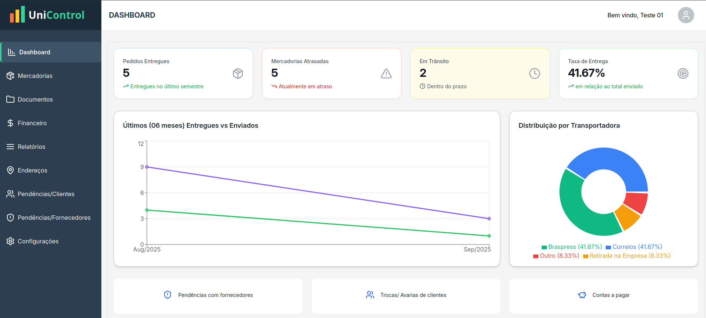

<h1 align="center">UniControl</h1>

<p align="center">
  Aplicação de gestão para empresas com atividades de compras, vendas e despacho de mercadorias.
</p>

<p align="center">
  
</p>

<p align="center">
  
</p>

## 🚀 Tecnologias

Este projeto foi desenvolvido utilizando as seguintes tecnologias e bibliotecas:

### Frontend & UI:

- **React** - Biblioteca principal para a interface do usuário.
- **Vite** - Ferramenta de build de alta performance.
- **Tailwind CSS** - Framework de CSS utilitário para estilização rápida e responsiva.
- **MUI (DataGrid)** - Componentes de interface, em especial a tabela de dados.
- **Recharts** - Biblioteca para a criação de gráficos no dashboard.
- **Lucide React** - Biblioteca de ícones.

### Gerenciamento de Dados & Autenticação:

- **React Hook Form** - Gerenciamento de formulários, estado e submissão.
- **Yup** - Validação de esquemas para formulários.
- **Firebase (Firestore)** - Banco de dados NoSQL para persistência de dados.
- **Firebase (Authentication)** - Sistema de autenticação de usuários.

### Roteamento:

- **React Router DOM** - Gerenciamento de rotas e navegação da aplicação.

## 💻 Projeto

O **UniControl** é uma solução robusta para o gerenciamento de empresas que lidam com controle de estoque, vendas e logística. O projeto oferece uma interface intuitiva para rastrear mercadorias enviadas, monitorar pendências de clientes e fornecedores, e visualizar dados financeiros.

### Principais Funcionalidades:

- **Dashboard Interativo**: Visão geral do desempenho do negócio com gráficos e KPIs (Key Performance Indicators) de entregas, mercadorias em trânsito e atrasadas.
- **Gestão de Mercadorias**: Cadastro e rastreamento de produtos com informações como nota fiscal, transportadora, previsão e data de entrega.
- **Controle de Pendências**: Seções dedicadas para gerenciar trocas e avarias de clientes, além de pendências com fornecedores.
- **Gestão Financeira**: Módulo de controle de contas a pagar.
- **Sistema de Usuários**: Autenticação e gestão de perfil com rotas privadas protegidas.

## 💻 Como Rodar o Projeto

Para iniciar a aplicação em seu ambiente local, siga os passos abaixo:

### Pré-requisitos:

- Node.js (versão 18 ou superior)
- npm ou yarn

### Passo a passo:

1. **Clone este repositório:**

```bash
git clone https://github.com/seu-usuario/seu-repositorio.git
```

2. **Navegue até o diretório do projeto:**

```bash
cd unicontrol
```

3. **Instale as dependências:**

```bash
npm install
# ou
yarn install
```

4. **Crie um arquivo .env na raiz do projeto e configure suas variáveis de ambiente do Firebase. Você pode usar o arquivo .env.example como modelo.**

5. **Inicie o servidor de desenvolvimento:**

```bash
npm run dev
# ou
yarn dev
```

A aplicação estará disponível em http://localhost:5173.

## :memo: Licença

Esse projeto está sob a licença MIT.

---

<p align="center">Feito por Pedro Douglas G. Queiroz 👋</p>
